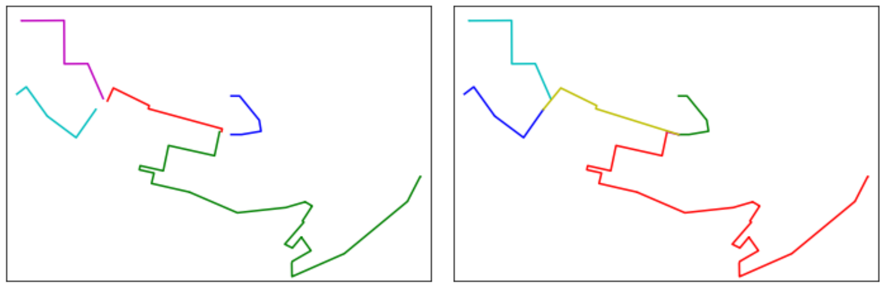

.. currentmodule:: algo.geometry

Trajectories and Network Geometry Processing
=============================================

**algo.geometry Module**
------------------------

This module provides functions for managing the geometry of network edges and GNSS trajectories.

The algorithms documented below are used to modify, connect, or adjust geometries during the construction of the mobility network.

.. decoupe_trace
.. extend_extremity

.. autosummary::
   :nosignatures:

   find_connection_candidate
   pull_point_to_other_tracks
   snap_lines_to_connect

Find a connection candidate
---------------------------

Searches for the closest network edge that intersects an extension of a given edge.

This function can be used to identify a potential connection between network edges that are not directly connected.

.. currentmodule:: algo.geometry

.. autofunction:: find_connection_candidate

Move trajectories closer together
---------------------------------

This algorithm moves trajectory points closer to neighboring trajectories, making spatially close trajectories more tightly clustered.

This preprocessing step can facilitate the detection of common movement patterns and the subsequent construction of the network.

.. figure:: ../../img/pull_point_to_other_tracks.png
   :width: 1000
   :align: center

   On the left, the trajectories are relatively sparse. On the right,
   after applying the algorithm, the trajectories are more tightly
   clustered, making common spatial patterns easier to detect.

.. currentmodule:: algo.geometry

.. autofunction:: pull_point_to_other_tracks

Connect nearby network edges
----------------------------

This algorithm connects network edges that are close to each other.
Two edges are connected only when their distance is smaller than the
specified ``tolerance``.

   On the left, the network edges are not connected. On the right,
   nearby edges have been connected when their distance is smaller than
   the specified ``tolerance``.

.. currentmodule:: algo.geometry

.. autofunction:: snap_lines_to_connect

